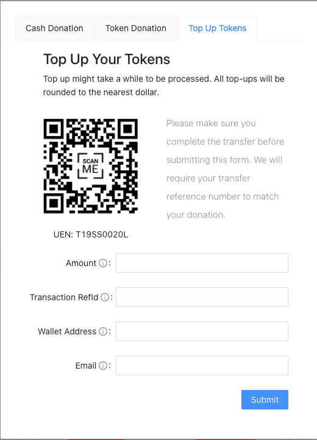

# Technical Discussion

## For Supporters

### Cash donations

.png>)

Once a cash donation is created, we will verify that the sum has been transferred. Thereafter a receipt following the transaction ID will be created to credit the tokens to the right project.

### Token Donations

.png>)

### Topping up your Tokens

## For Project Initiators

Each initiative would be required to provide a breakdown of their budget and clear objectives that need to be met.&#x20;

### Releasing Funds

.png>)

Funds will only be released to the projects once they prove that these objectives are met. This provides transparency in how they will be spending the money, and also accountability in that they are unable to claim the funds and abandon the project. Even after it ends, if relevant, the initiative will be archived along with its various progress updates and the final product. Anyone would be able to access these files at any time, allowing for a continuous cycle of learning and building upon previous initiatives.
